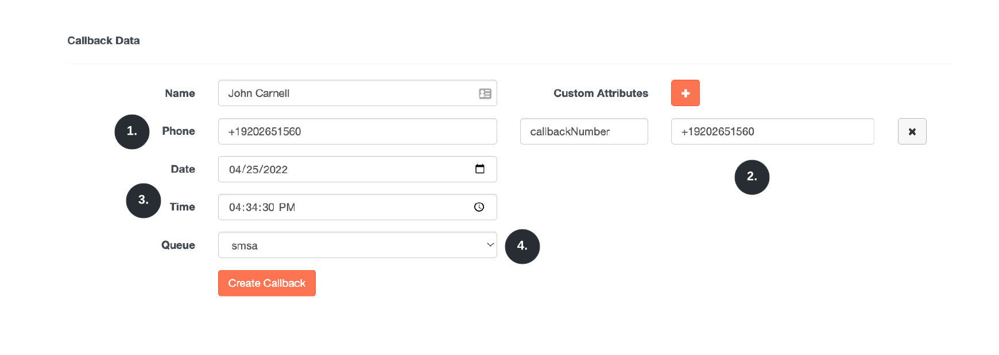
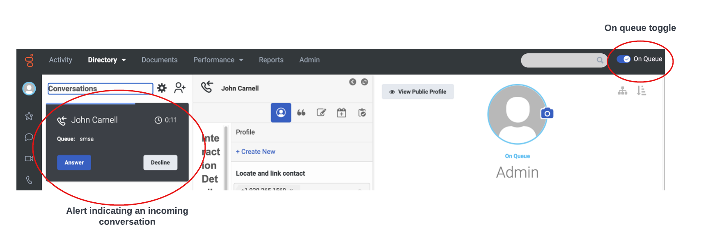
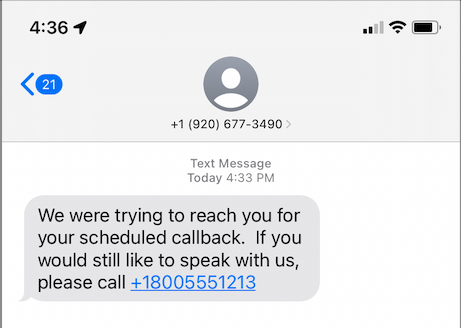

# Implement an automated SMS message when a callback is not answered (DRAFT)

This Genesys cloud blueprint demonstrates how send an SMS message to a customer when an agent attempts to to reach a customer on a callback and the customer is unavailable. All of the components in this solution can be deployed using Terraform and the Genesys Cloud CX as Code provider.

:::{"alert":"info","title":"Important Information","collapsible":false,"autoCollapse":false}
In order to use this blueprint, you must have previously purchased an SMS-enabled number from Genesys Cloud. The phone number can be passed into the Terraform configuration used in this blueprint. Instructions for purchasing a Genesys Cloud SMS number can be found [here](https://help.mypurecloud.com/articles/purchase-sms-long-code-numbers/ "Goes to the purchase an SMS phone number page").
::: 


## Scenario

An organization wants to provide a "high-touch" experience and ensure that they contact a customer who has requested a followup call from an agent, even if the customer is not available when the agent calls. To do this the organization wants to:

1. **Schedule a callback to their customer with an agent.** This initial scheduled callback could be from a customer requesting the organization contact them at a certain time period or it could be part of a larger callback campaign. The callback will go onto a queue at its scheduled time.

2. **Have the agent try to reach the customer.** The agent receives an incoming notification of a callback and attempts to contact the customer.

3. **The customer is unavailable.** The agent fails to reach the customer. The agent selects a wrap-up code indicating that customer is unavailable and ends the conversation.

4. **Genesys Cloud publishes a business event indicating the conversation has ended.** A process automation trigger fires and sees if the incoming event matches a set of pre-defined criteria.

5. **The events matches the trigger criteria and initiates a Architect workflow.** The architect workflow inspects the incoming message and calls a data action that uses the Genesys Cloud Agentless public api to send an SMS message.

6. **The customer receives an SMS message on their mobile phone indicating that the organization tried to contact them, we unable .** The SMS message will tell the customer that the organization tried to reach them and include a phone number the customer can call to reschedule a followup call.

## Solution

This blueprint explains how to use the following Genesys Cloud capabilities: 

* **Process automation trigger** - allows business workflows to be initiated in response to events being emitted from Genesys Cloud.
* **Architect workflow** - allows a workflow to be initiated that can automate common business tasks in response to events emitted from Genesys Cloud.
* **SMS Number Purchase** - allows a customer to purchase a SMS enabled phone number that can be used to send SMS messages from Genesys Cloud.
* **Data action** - integrates a REST endpoint or AWS Lambda into into an Genesys Cloud architect workflow.

## Solution components

* **Process automation triggers** - An event-based automation mechanism that allows Architect workflows to be initiated within Genesys Cloud based on Genesys Cloud events.
* **Architect Workflows** - A Genesys Cloud workflow engine that allows developer to build executable workflows using a GUI based tool.
* **Agentless API** - A Genesys Cloud API that allows developers to send SMS messages without the need for an agent initiate the message or the call.
* **CX as Code** - A Genesys Cloud DevOps tool that allows Genesys Cloud configuration to be stored in source control as text files and then deployed via CI/CD pipeline.

## Software development kits

No Genesys Cloud SDKs are needed for this blueprint solution. 

## Prerequisites

### Specialized knowledge

* Administrator-level knowledge of Genesys Cloud
* Experience with Genesys Cloud Architect
* Experience with Purchasing an SMS Phone number
* Experience with Genesys Cloud Data Actions and Integrations
* Experience with Terraform

### Genesys Cloud account

* A Genesys Cloud license. For more information see, [Genesys Cloud Pricing](https://www.genesys.com/pricing "Goes to the Genesys Cloud pricing page") in the Genesys Cloud website. For this project, you need at least a Genesys Cloud CX 3 license and the GPE and GeneralPurpose Workflow product for your organization.
* Feature toggles. In order to use this blueprint you need to be part of the process automation trigger beta program. To become part of this program please contact the process automation trigger product manager Richard Schott (richard.schott@genesys.com) to become part of the beta.
* Master Admin role. For more information see, [Roles and permissions overview](https://help.mypurecloud.com/?p=24360 "Goes to the Roles and permissions overview article") in the Genesys Cloud Resource Center. Once the appropriate feature toggle is in place you need ensure that that the role you are using for this blueprint, you must ensure that the role assigned to the OAuth Client has the following permissions set: `SMS>All Permissions`, `processautomation>All Permissions`, and `Architect>job>All Permissions`.
* CX as Code. For more information see, [CX as Code](https://developer.genesys.cloud/devapps/cx-as-code/ "Goes to the CX as Code page") in the Genesys Cloud Developer Center.

### Development tools running in your local environment

* Terraform (the latest binary). For more information, see [Download Terraform](https://www.terraform.io/downloads.html "Goes to the Download Terraform page") on the Terraform website.

## Implementation steps

### Clone the GitHub repository 

Clone the [sms-followup-on-missed-callback-blueprint](https://github.com/GenesysCloudBlueprints/sms-followup-on-missed-callback-blueprint "Goes to the sms-followup-on-missed-callback-blueprint github repository") GitHub repository on your local machine. The sms-followup-on-missed-callback-blueprint folder includes solution-specific scripts and files in these sub-folders:

* terraform - All Terraform files and Architect flows that are needed to deploy the application

### Setup your Terraform and Public API OAuth Client Credential grants
This blueprint will need two OAuth Client Credential grants to execute this blueprint. These two OAuth Clients are used for:

1. Running CX as Code against a Genesys Cloud organization. 
2. Invoking the Agentless public API via a data action.

To understand how to configure an OAuth Client Credential grant please take a look at this [article](https://help.mypurecloud.com/articles/create-an-oauth-client/ "Goes to the create an oauth client grant in the Genesys Cloud resource center"). 

:::primary
**Note:** For this project, both Genesys Cloud OAuth clients requires the Master Admin role. For a true production application, each Genesys Cloud OAuth client should be configured with the minimum amount of privileges needed to carry out its work.
:::

### Purchase an SMS phone number from Genesys Cloud

To purchase an SMS phone number via Genesys Cloud, please refer to the following help center [article](https://help.mypurecloud.com/articles/purchase-sms-long-code-numbers/ "Goes to the purchase an sms long code number in the Genesys Cloud resource center").

### Set up your Genesys Cloud credentials for use by Terraform

1. To run this project using the AWS Terraform provider, open a terminal window and set the following environment variables:

 * `GENESYSCLOUD_OAUTHCLIENT_ID` - This is the Genesys Cloud client credential grant Id that CX as Code executes against. 
 * `GENESYSCLOUD_OAUTHCLIENT_SECRET` - This is the Genesys Cloud client credential secret that CX as Code executes against. 
 * `GENESYSCLOUD_REGION` - This is the Genesys Cloud region in your organization.

2. Run Terraform in the terminal window where the environment variables are set. 


### Configure your Terraform build

You must define several values that are specific to your AWS region and Genesys Cloud organization. 

In the blueprint/terraform/dev.auto.tfvars file, set the following values:

* `callback_sms_oauthclient` - The OAuth client id that the Agentless public api call (via the Data Action) will run under. This will **typically** be different then the OAuth client id you will run CX as Code under.
* `callback_sms_oauthsecret` - The OAuth client secret for the OAuth client id that the Agentless public api call (via the Data Action) will run under.
* `callback_originating_sms_phonenumber` - This is the SMS-enabled phone number purchased from Genesys Cloud. This number is in E.164 format and will be the originating phone number sending the SMS message.
* `callback_phonenumber`- This will be a phone number injected into the text message sent to the customer. For the purposes of this demonstration this phone number is the phone number the customer will be asked to call back to schedule another followup call.
* `callback_agent_email`- This is the email address of the agent assigned to the queue created for this demonstration.

The following is an example of the dev.auto.tfvars file that was created by the author of this blueprint.

```
callback_sms_oauthclient="363245d2-acbd-4709-a652-4114f1d88888"
callback_sms_oauthsecret="vjbhxWqwObEg7ZYGd9654o0PC2iKu22OwCPz0pgQj5M"
callback_originating_sms_phonenumber="+19206775555"
callback_phonenumber="+18005551213"
callback_agent_email="john.smith@genesys.com"
```

:::primary
The above values are not actual values that can be used within your own deployment. Please make sure you provide values appropriate to your own organization before running this blueprint.
:::

### Run Terraform

You are now ready to run this blueprint solution for your organization. ßChange to the blueprints/terraform folder and issue these commands:

* `terraform plan` - This executes a trial run against your Genesys Cloud organization and shows you a list of all the AWS, and Genesys Cloud resources created. Review this list and make sure you are comfortable with the activity being undertake before continuing to the second step.

* `terraform apply --auto-approve` - This does the actual object creation and deployment against your AWS and Genesys Cloud accounts. The --auto--approve flag steps the approval step required before creating the objects.

After the `terraform apply --auto-approve` command has completed, you should see the output of the entire run along with the number of objects successfully created by Terraform. Keep these points in mind:

* This project assumes you are running using a local Terraform backing state. This means that the `tfstate` files will be created in the same folder where you ran the project. Terraform does not recommend using local Terraform backing state files unless you run from a desktop and are comfortable with the deleted files.

* As long as your local Terraform backing state projects are kept, you can tear down the blueprint in question by changing to the `blueprint/terraform` folder and issuing a `terraform destroy --auto-approve` command. This destroys all objects currently managed by the local Terraform backing state.

### Test your deployment

After the process automation workflow is deployed, you can create a Genesys Cloud callback by using the Genesys Cloud developer center's [callback tool](/developer-tools/#/callback "Goes to the Genesys Cloud callback tools page").

Enter the following values for the callback tool:



1. E.164 formatted phone number the customer can receive a text message to.
2. A custom participant attribute containing the same E.164 formatted number as bullet #1 above. This number needs to be stored in a participant attribute because an Architect workflow will not have access to the DNIS number for the original call. This value needs to be stored in a participant attribute called callbackNumber. 
3. The time in which the callback will be scheduled. Remember, even if this value is in the past, it will take approximately 1 minute after the form is submitted for the callback to come through.
4. The queue that the callback will be sent to. By default, the queue name for this blueprint is called `smsa`.

Click on the Create Callback button to create the callback.

:::primary
If the date/time you created a callback occurs in the past, it can take up to a minute for the callback to appear in queue for a Genesys Cloud agent to pickup.
:::

After you create the callback, you can: 

1. Login Genesys Cloud as the agent you defined in `callback_agent_email` variable defined in the Terraform flow. (e.g. john.smith@genesys.com). 
2. Move yourself into an queue status.

Shortly after you do this, you should see an alert popup indicating that there is a callback waiting to be picked up. The image below illustrates what you should expect:



To trigger the workflow, you need to press the Wrap-codes button, select the "Cust unavailable" wrap-up code and click the Done button. This will end the call. Shortly after this you should received an SMS text message to the phone number you configured in the callback tool. The screenshot below illustrates this:



## Additional resources
* [Genesys Cloud About creating an OAuth client](https://help.mypurecloud.com/articles/create-an-oauth-client/ "Goes to the About creating an OAuth client article") article in the Genesys Cloud Resource Center
* [Genesys Cloud About the data actions integrations](https://help.mypurecloud.com/?p=209478 "Goes to the About the data actions integrations article") article in the Genesys Cloud Resource Center
* [Genesys Cloud About the AWS Lambda Data Actions integration](https://help.mypurecloud.com/?p=178553 "Goes to the About the AWS Lambda Data Actions integration article") article in the Genesys Cloud Resource Center
* [Genesys Cloud Terraform provider documentation](https://registry.terraform.io/providers/MyPureCloud/genesyscloud/latest/docs "Goes to the Genesys Cloud provider page") in the Terraform documentation
* [Genesys Cloud DevOps repository](https://github.com/GenesysCloudDevOps "Goes to the Genesys Cloud DevOps repository page") in GitHub
* [sms-followup-on-missed-callback-blueprint](https://github.com/GenesysCloudBlueprints/sms-followup-on-missed-callback-blueprint "Goes to the sms-followup-on-missed-callback-blueprint repository") in GitHub
